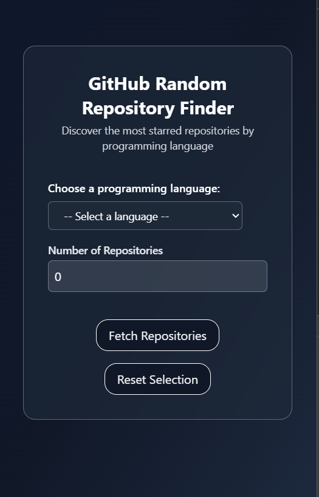
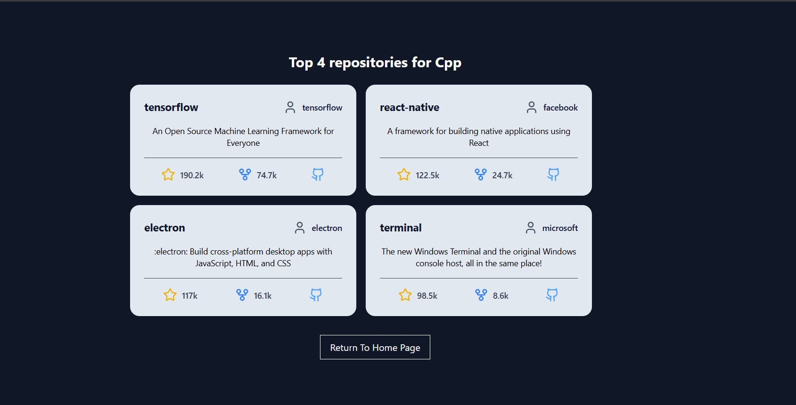

# Random RepoFinder

A responsive React + Vite application that helps you discover the most starred GitHub repositories based on your selected programming language and number of results.

---

## 🚀 Features

- 🔍 Select a programming language to filter repositories
- #️⃣ Specify the number of repositories to display
- 💎 Responsive UI with glassmorphism effects
- ⚠️ Loading and error handling
- 🎨 Clean, modern design using Tailwind CSS
- 🌐 Uses GitHub Search API for fetching repositories

---

## 🛠 Tech Stack

- ⚛️ React
- ⚡ Vite (build tool)
- 💨 Tailwind CSS (styling)
- 🔀 React Router (routing)
- 🧩 Lucide React (icons)
- 🌐 Fetch API for GitHub integration

---

## 🧑‍💻 Getting Started

### ✅ Prerequisites

- Node.js (v14+ recommended)
- npm or yarn

### 📦 Installation

1. Clone the repository:

   ```bash
   git clone https://github.com/F7Z7/random-repofinder.git
   cd random-repofinder
2. Install dependencies:

   ```bash
    npm install
3. Start the development server:
    ```bash
    npm run dev
4. Open http://localhost:5173 in your browser to see the app.   

## Folder Structure
```
├─ .gitignore
├─ README.md
├─ demo
│  ├─ Home-Desktop.png
│  ├─ Home-Mobile.png
│  ├─ Result-Mobile.png
│  └─ Results-Desktop.png
├─ eslint.config.js
├─ index.html
├─ package-lock.json
├─ package.json
├─ public
│  └─ vite.svg
├─ src
│  ├─ App.css
│  ├─ App.jsx
│  ├─ components
│  │  ├─ Button.jsx
│  │  ├─ DisplayRepo.jsx
│  │  ├─ Dropdown.jsx
│  │  ├─ Languages.jsx
│  │  └─ fetchRepo.jsx
│  ├─ index.css
│  ├─ main.jsx
│  └─ pages
│     ├─ Hero.jsx
│     └─ Results.jsx
└─ vite.config.js
```
## Sample Screenshots
### Home Page-Desktop

### Home Page-Mobile

### Results Page



### Thank You For Visting
